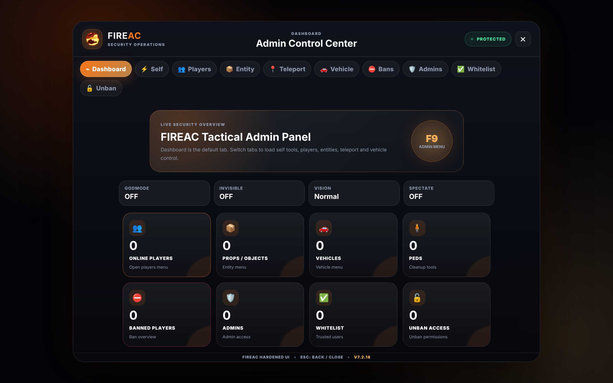

<h1 align="center">
  
  <b>UNIQUE_AC</b>
  
</h1>

<p align="center">
  <b>
    Customized &amp; maintained by <a href="https://arshiahub.ir">Arshia</a> — <a href="https://arshiahub.ir">arshiahub.ir</a>
  </b>
</p>

---

### 🚀 What is UNIQUE_AC?

UNIQUE_AC is a free and lightweight FiveM anti-cheat. It provides useful basic client-side and server-side checks while keeping installation and administration simple.

UNIQUE_AC works with **ESX**, **QBCore**, and **Standalone** servers. The current version includes improved player lifecycle handling and fixes the previous spawn and incorrect-player punishment problems.

UNIQUE_AC is built and maintained by **Arshia**, designed to fully replace other FiveM anti-cheats with a hardened, all-in-one security layer.

---

### 🖥️ Admin Panel



---

---

### ⚙️ Requirements

<table align='center'>
  <tr>
    <td align='center'>
      <a href="https://github.com/jaimeadf/discord-screenshot/releases">discord-screenshot</a><br>For taking screenshots
    </td>
    <td align='center'>
      <a href="https://github.com/overextended/oxmysql/releases">oxmysql</a><br>For saving SQL data
    </td>
  </tr>
</table>

---

### 🛡️ Features

<details>
  <summary><b>Client Side Protection</b></summary>

- Anti-Health Hack
- Anti-Armor Hack
- Anti-Infinite Ammo
- Anti-Spectate
- Anti-Infinite Stamina
- Anti-Blacklist Weapon
- Anti-God Mode
- Anti-Noclip
- Anti-Rainbow Vehicle
- Anti-Teleport Vehicle / Ped
- Anti-Invisible
- Anti-Change Speed
- Anti-Free Camera
- Anti-Plate Changer
- Anti-Blacklist Plate
- Anti-Night Vision / Thermal Vision
- Anti-Super Jump
- Anti-Tiny Ped
- Anti-Ped Changer
- Anti-Blacklist Tasks / Animations
- Anti-Pickup Collect
- Anti-Suicide
</details>

<details>
  <summary><b>Server Side Protection</b></summary>

- Anti-Spam Chat
- Anti-Blacklist Commands
- Anti-Weapon Damage Changer
- Anti-Blacklist Word
- Anti-Bring All
- Anti-Blacklist Trigger
- Anti-Spam Trigger
- Anti-Clear Ped Tasks
- Anti-Taze Players
- Anti-Inject
- Anti-Blacklist Explosion
- Anti-Explosion Spam
- Anti-Blacklist Object / Ped / Vehicle
- Anti-Spam Object / Ped / Vehicle
- Anti-Change Permission
- Anti-Play Sound
- Server-Side Admin Menu Authorization
- Server-Validated Ban and Unban Actions
</details>

---

### 📦 Installation

🔗 For support and updates, visit:  
👉 **[arshiahub.ir](https://arshiahub.ir)**

Start `oxmysql` before UNIQUE_AC:

```cfg
ensure oxmysql
ensure UNIQUE_AC
```

Import `database.sql` before starting the resource for the first time.

---

### ✅ Whitelist

Manage authorized players, admins, and permissions easily.  
📖 For more help, visit:  
👉 **[arshiahub.ir](https://arshiahub.ir)**

---

### 🔓 Unban

Use the `/funban [Ban ID]` command for unbanning players.  
📖 For more help, visit:  
👉 **[arshiahub.ir](https://arshiahub.ir)**

---

### 👑 Add Admin

Use the `addadmin [ID]` command from the server console to add an administrator.  
Administrators can access the admin panel using `/uniqueac` or `/uniqueacmenu`.

📖 For more help, visit:  
👉 **[arshiahub.ir](https://arshiahub.ir)**

---

### 📊 Exports

```lua
exports['UNIQUE_AC']:UNIQUE_AC_ACTION(source, "BAN", "Cheating", "Using godmode")
exports['UNIQUE_AC']:UNIQUE_AC_CHANGE_TEMP_WHITELIST(source, true, 15000)
exports['UNIQUE_AC']:UNIQUE_AC_CHECK_TEMP_WHITELIST(source)
```

Server-side ban and unban exports:

```lua
exports['UNIQUE_AC']:BanPlayer(playerId, reason, issuer)
exports['UNIQUE_AC']:UnbanPlayer(banId, issuer)
```

📖 For more help, visit:  
👉 **[arshiahub.ir](https://arshiahub.ir)**

---

### 📝 Commands

| Command | Description |
| ------- | ----------- |
| `funban [Ban ID]` | Unban a user from the database |
| `unban [Ban ID]` | Unban a user from the database |
| `addadmin [ID]` | Add an administrator with admin-menu access |
| `addwhitelist [ID]` | Add a player to the whitelist |
| `addunban [ID]` | Grant unban access |
| `uniqueacban [ID] [Reason]` | Ban a player |
| `uniqueacunban [Ban ID]` | Remove a ban |

📖 For more help, visit:  
👉 **[arshiahub.ir](https://arshiahub.ir)**

---

### 🎓 Support

📖 Questions or issues? Reach out at:  
👉 **[arshiahub.ir](https://arshiahub.ir)**

---

### 🛠️ Tools

The `tools/` folder has standalone scripts for operational tasks:

- `migrate.sh` — export/import UNIQUE_AC's own database tables between two MySQL
  instances (e.g. when moving hosts). Wraps `mysqldump`/`mysql` directly rather than
  reinventing table copying.
- `git-tag-version.sh` — tags the repo with `v<VERSION>` whenever VERSION changes.
  Install as `.git/hooks/post-commit` for it to run automatically, or call it manually.

---

### 📜 License

UNIQUE_AC - AGPL-3.0 License  
Copyright © 2026 **Arshia** — [arshiahub.ir](https://arshiahub.ir)

> This software is free but without any warranty.  
> See the [GNU License](https://www.gnu.org/licenses/) for details.

---
